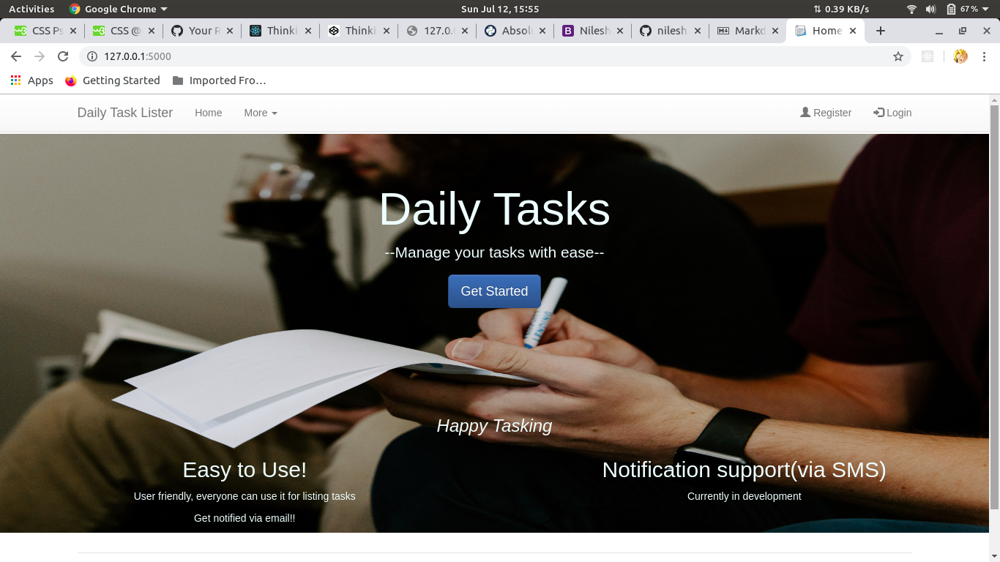
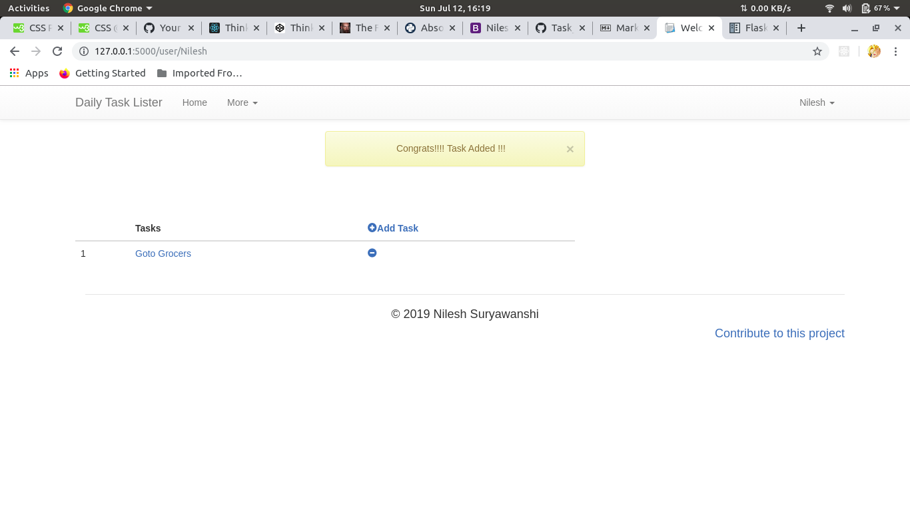
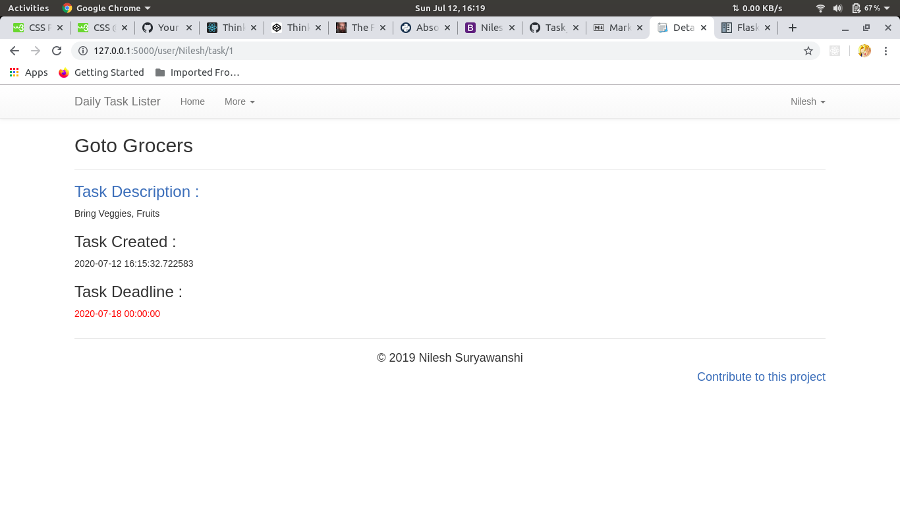

# Task Lister
## My First Web Application in Python-Flask.
### Description
> 1. This is a basic web application, which allows the user to login and create tasks/to-do items.
> 2. User creates task by entering the task heading, task description and the deadline *(till when the task is to be completed)* . 
> 3. The user can **update, delete** the tasks accordingly. The application also sends ***email notification*** to the registered email about the deadline of the task. 

### Working
> - The user has to first register himself/herself using basic details like *email*.
> - Once the registration is complete the user gets a *Welcome Email*.
> - The user can the login and start creating tasks.
>     - *The user gets an email notification 24 hrs prior to the task deadline*.

### Preview

### Note
- In config.py use your own
    - database URL
    - Email  *(Mandatory for email notification)*
    - Password  *(Mandatory for email notification)*
